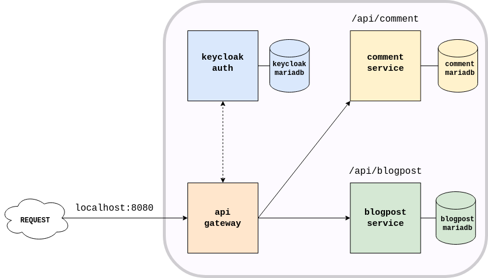

# Microgrid

An application implemented as a collection of microservices communicating together
 in a manner which encourage low coupling and high cohesion.



### Gateway
An unified entrypoint/interface for the microservice system. 
This gateway will also communicate with the auth service (keycloak).
The keycloak endpoint provide the necessary public keys to the gateway to be able to
verify `JWT` tokens and not pass on malformed `JWT`s to the internal system.
Customize and tailor the API based on who the client is; 
different clients need different APIs.

### Auth

>*Secrets are checked in to version control for ease of development. 
All secrets must be excluded from version control for any production environment*

Session management become complicated as each service is self-contained and stateless.
`JWT` is attached to each request and shared across services. 
`JWT` are stateless (client validate token without 3rd party) and time bound. 

To keep the `iss` part of the `JWT` consistent, the docker name of keycloak has to be a
valid hostname that points to the running keycloak instance.
Additionally, *Frontend URL* of keycloak container needs to be set in keycloak: `http://keycloak:8082`
Add the following line to `/etc/hosts`
```
127.0.0.1 keycloak
```

---

### Kafka Connect
Initialize debezium user ***once*** by either commands:
```
mysql -u root -p < /initial/create-debezium-user.sql

mysql> source /initial/create-debezium-user.sql
```
Submit JSON request to Kafka Connect to start the source connector
```
curl \
    -X POST -H "Accept:application/json" -H "Content-Type: application/json" \
    http://localhost:8084/connectors/ -d @configs/kafka-connect/blogdb-connector.json
```
Same for sink connector
```
curl \
    -X POST -H "Accept:application/json" -H "Content-Type: application/json" \
    http://localhost:8084/connectors/ -d @configs/kafka-connect/blogdb-connector-sink.json

```
Verify
```
curl -H "Accept:application/json" localhost:8084/connectors/
```
Output
```
["blogdb-connector"]
```

#### Monitoring event message from broker container
Find specific topic (e.g. schema changes, data changes)
```
kafka-topics  --list --bootstrap-server localhost:9092
```
Read from topic
```
kafka-console-consumer --bootstrap-server localhost:9092 --topic blogdb.changes.blogpost.blog_post --from-beginning
```
Directly through docker compose
```
docker-compose exec broker kafka-console-consumer \                                                                                                                                                                                                 130 ↵
    --bootstrap-server broker:9092 \
    --from-beginning \
    --property print.key=true \
    --topic blogdb.changes.blogpost.blog_post
```
## Improvements

- `Keycloak`: Partially implemented. Authentication is required to talk to services.
  - Implement role-based (e.g. `reader`, `author`) user access
- `CircuitBreaker`: Addressing failures in communication between services (e.g., service down, response dropped)
- `Apache Kafka`: Distributed event stream. Make the system more robust by notifying services about events 
and cascading changes on all relevant services
  - ***scenario***: Comment posted to blog that is removed
  - ***fix***: CommentService notified about blog post removal.

---

### Run application
Run keycloak and fetch the client secret. 
Put the secret (`KEYCLOAK_CLIENT_SECRET=`) in `/.env` 
where docker-compose will be able to load it as an environment variable.

#### Maven
```bash
docker run -p 8082:8080 -e KEYCLOAK_ADMIN=admin -e KEYCLOAK_ADMIN_PASSWORD=admin \
  quay.io/keycloak/keycloak:21.0.0 start-dev
  
cd blog-service
# requires local database
mvn spring-boot:run

cd comment-service
# requires local database
mvn spring-boot:run

cd api-gateway
mvn spring-boot:run
```

#### Docker
```bash
docker-compose up
```
